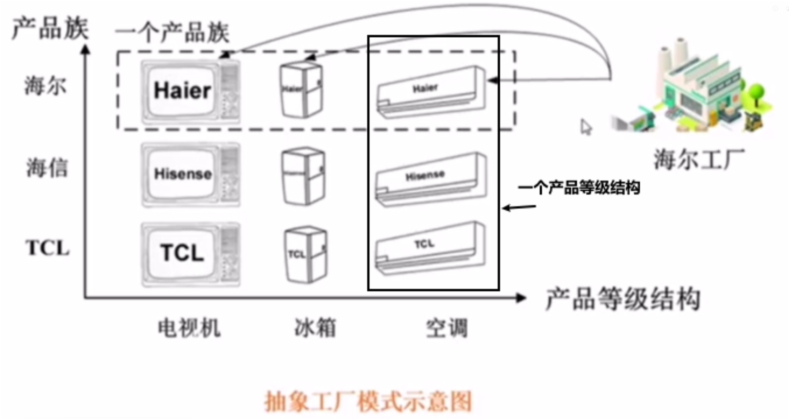
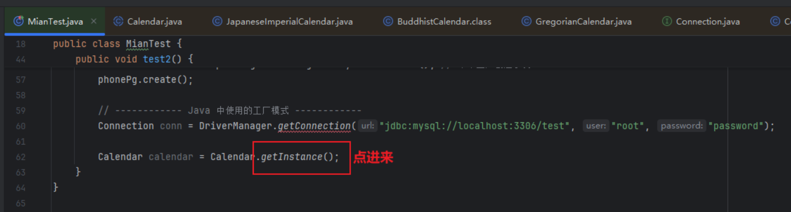
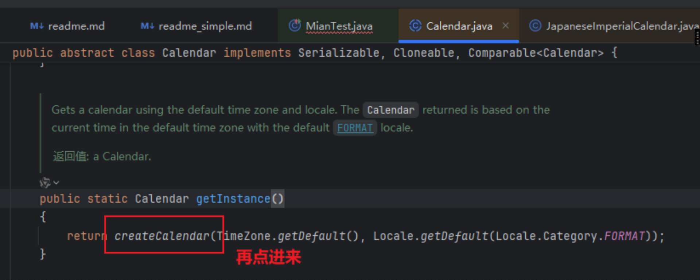
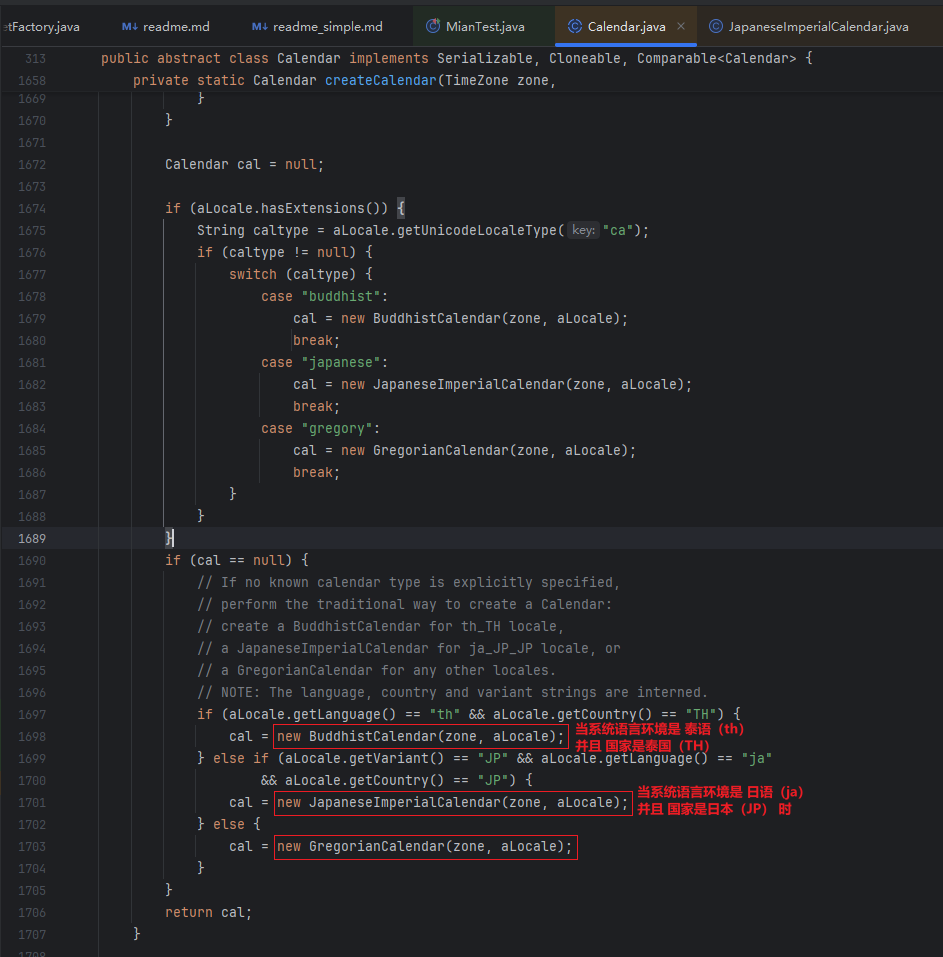

# 设计模式之 工厂模式（工厂方法、抽象工厂） 正式版
定义：工厂模式（Factory Pattern）是设计模式中的一种，它属于创建型模式，主要用来创建对象。
工厂模式的核心思想是定义一个用于创建对象的接口，让子类决定实例化哪一个类。 通过使用工厂模式，
可以将对象的创建过程封装到工厂类中，客户端只需要关心对象的使用，而不需要关心如何创建该对象。 

## 工厂方法模式（Factory Method）
工厂方法模式是工厂模式的一种常见实现方式，它通过定义一个创建产品的接口，让子类去实现具体的工厂方法，从而实现对象的创建。

主要角色：
- Product：产品接口，定义了产品的规范。
- ConcreteProduct：具体的产品类，实现了产品接口。
- Creator：创建者接口，声明了工厂方法。
- ConcreteCreator：具体的创建者类，重写工厂方法，返回具体的产品对象。

示例代码：
```java
// 产品接口
interface Product {
    void create();
}

// 具体产品A
class ConcreteProductA implements Product {
    @Override
    public void create() {
        System.out.println("Creating Product A");
    }
}

// 具体产品B
class ConcreteProductB implements Product {
    @Override
    public void create() {
        System.out.println("Creating Product B");
    }
}

// 工厂接口
interface Creator {
    Product createProduct();
}

// 具体工厂A
class ConcreteCreatorA implements Creator {
    @Override
    public Product createProduct() {
        return new ConcreteProductA();
    }
}

// 具体工厂B
class ConcreteCreatorB implements Creator {
    @Override
    public Product createProduct() {
        return new ConcreteProductB();
    }
}

// 客户端代码
public class Main {
    public static void main(String[] args) {
        Creator creatorA = new ConcreteCreatorA();
        Product productA = creatorA.createProduct();
        productA.create();

        Creator creatorB = new ConcreteCreatorB();
        Product productB = creatorB.createProduct();
        productB.create();
    }
} 
```

## 抽象工厂模式（Abstract Factory）
抽象工厂模式是工厂模式的进一步扩展。它不仅提供一个创建单一产品的方法，还可以创建一系列相关或相互依赖的产品。
抽象工厂模式会定义多个工厂方法，用于创建一族产品。

主要角色：
- AbstractFactory：抽象工厂，定义了创建一族产品的抽象方法。
- ConcreteFactory：具体工厂，实现了创建具体产品的方法。
- AbstractProduct：抽象产品，定义了产品的通用接口。
- ConcreteProduct：具体产品，实现了抽象产品接口。
- Client：客户端使用工厂方法来创建产品。

```java
// 抽象产品A
interface ProductA {
    void createA();
}

// 抽象产品B
interface ProductB {
    void createB();
}

// 具体产品A1
class ConcreteProductA1 implements ProductA {
    @Override
    public void createA() {
        System.out.println("Creating Product A1");
    }
}

// 具体产品B1
class ConcreteProductB1 implements ProductB {
    @Override
    public void createB() {
        System.out.println("Creating Product B1");
    }
}

// 具体产品A2
class ConcreteProductA2 implements ProductA {
    @Override
    public void createA() {
        System.out.println("Creating Product A2");
    }
}

// 具体产品B2
class ConcreteProductB2 implements ProductB {
    @Override
    public void createB() {
        System.out.println("Creating Product B2");
    }
}

// 抽象工厂
interface AbstractFactory {
    ProductA createProductA();
    ProductB createProductB();
}

// 具体工厂1
class ConcreteFactory1 implements AbstractFactory {
    @Override
    public ProductA createProductA() {
        return new ConcreteProductA1();
    }

    @Override
    public ProductB createProductB() {
        return new ConcreteProductB1();
    }
}

// 具体工厂2
class ConcreteFactory2 implements AbstractFactory {
    @Override
    public ProductA createProductA() {
        return new ConcreteProductA2();
    }

    @Override
    public ProductB createProductB() {
        return new ConcreteProductB2();
    }
}

// 客户端代码
public class Main {
    public static void main(String[] args) {
        AbstractFactory factory1 = new ConcreteFactory1();
        ProductA productA1 = factory1.createProductA();
        ProductB productB1 = factory1.createProductB();
        productA1.createA();
        productB1.createB();

        AbstractFactory factory2 = new ConcreteFactory2();
        ProductA productA2 = factory2.createProductA();
        ProductB productB2 = factory2.createProductB();
        productA2.createA();
        productB2.createB();
    }
}
```
## 工厂模式的优缺点
优点：
- 封装性好：客户端不需要知道具体的产品类，只需要与工厂接口进行交互，遵循了“依赖抽象，不依赖具体”的原则。
- 解耦合：创建产品的过程被工厂类封装，客户端代码与具体的产品类解耦。
- 扩展性强：如果需要增加新产品，只需要扩展工厂类和产品类，不需要修改客户端代码。

缺点：
- 类的个数增加：每增加一个产品就需要增加一个具体工厂类，可能会使系统变得复杂。
- 不适用于所有场景：当产品种类较少时，工厂模式可能会显得过于复杂。

## 产品等级结构与产品族
产品等级结构：产品等级结构即产品的继承结构，如一个抽象类是电视机，其子类有海尔电视机、海信电视机、TCL电视机，则抽象电视机与具体品牌的电视机之间构成了一个产品等级结构。

产品族：在抽象工厂模式中，产品族是指由同一个工厂生产的，位于不同产品等级结构中的一组产品，如海尔电器工厂生产的海尔电视机、海尔电冰箱。海尔电视机、海尔电冰箱构成了一个产品族。



## Java 或 Spring 中的应用（源码分析）
在 Java 中，工厂模式应用广泛，如 JDK 中的 `java.util.Calendar`、`java.util.Date`、`java.util.TimeZone` 等类都是通过工厂模式创建的。

|场景	|工厂模式|
------|--------
Calendar.getInstance()|	工厂方法模式
List.of() / Set.of()	|工厂方法模式
DriverManager.getConnection()|	工厂方法模式
Spring BeanFactory	|工厂方法模式 / 抽象工厂模式
Spring FactoryBean<T>|	工厂方法模式
Spring ProxyFactoryBean|	工厂方法模式
Spring DefaultListableBeanFactory|	抽象工厂模式
MyBatis SqlSessionFactory	|工厂方法模式
Hibernate SessionFactory	|工厂方法模式

我们直接挑`Calendar.getInstance()`的源码来分析：


Calendar 是一个抽象类，它提供了一些公共方法，如 getInstance()、getTime() 等。
在 `Calendar.java` 中，调用了 `createCalendar()` 方法，继续追踪 `createCalendar()` 的实现：



从源码可以看出，getInstance() 方法返回的是 Calendar 的子类实例，而不是 Calendar 本身：
- 当系统语言环境是 泰语（th） 并且 国家是泰国（TH） 时，返回 BuddhistCalendar（佛历）。
- 当系统语言环境是 日语（ja） 并且 国家是日本（JP） 时，返回 JapaneseImperialCalendar（日本历）。
- 其他情况下，默认返回 GregorianCalendar（公历）。



工厂方法模式 的核心思想是“延迟到子类决定实例化哪个对象”。在这里定义了一个创建对象的接口（Calendar），
但由子类决定实例化哪种类型（GregorianCalendar、BuddhistCalendar、JapaneseImperialCalendar）。
在其间屏蔽了对象创建的细节，调用者只需调用 getInstance()，而不需要知道底层具体实现。
此外，若未来需要支持更多日历类型，只需在 createCalendar() 方法中增加新的逻辑。

Calendar 的工厂模式并没有严格对应 抽象工厂模式 的四个角色（抽象工厂、具体工厂、抽象产品、具体产品），Calendar 是一个抽象类，而不是一个接口，也没有明显的具体工厂类。

我们可以从类的层级关系和方法的作用来看：

角色|	对应 Calendar 代码|	说明
-|-|-
抽象产品（Product）|	Calendar|	统一定义了日历的抽象行为。
具体产品（ConcreteProduct）|	GregorianCalendar、BuddhistCalendar、JapaneseImperialCalendar|	具体日历实现，不同的产品代表不同的日历类型。
抽象工厂（Factory）|	Calendar（静态工厂方法 getInstance()）|	规定了创建 Calendar 对象的工厂接口。
具体工厂（ConcreteFactory）|	createCalendar() 方法|	根据 Locale 选择适当的 Calendar 实现，类似具体工厂的角色。

在 工厂方法模式 中，工厂本身也是一个接口或抽象类。但在 Calendar 这个例子里，getInstance() 作为静态工厂方法，隐藏了创建细节：
```java
public static Calendar getInstance() {
    return createCalendar(TimeZone.getDefault(), Locale.getDefault(Locale.Category.FORMAT));
}
```
这个方法是“抽象工厂”，它不直接创建具体的 Calendar 实例，而是调用 createCalendar()，由 createCalendar() 充当“具体工厂”的角色。