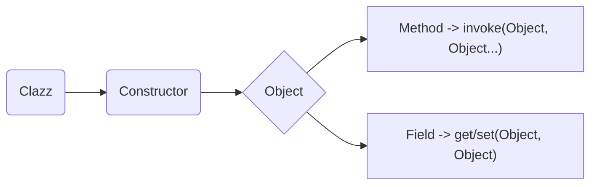
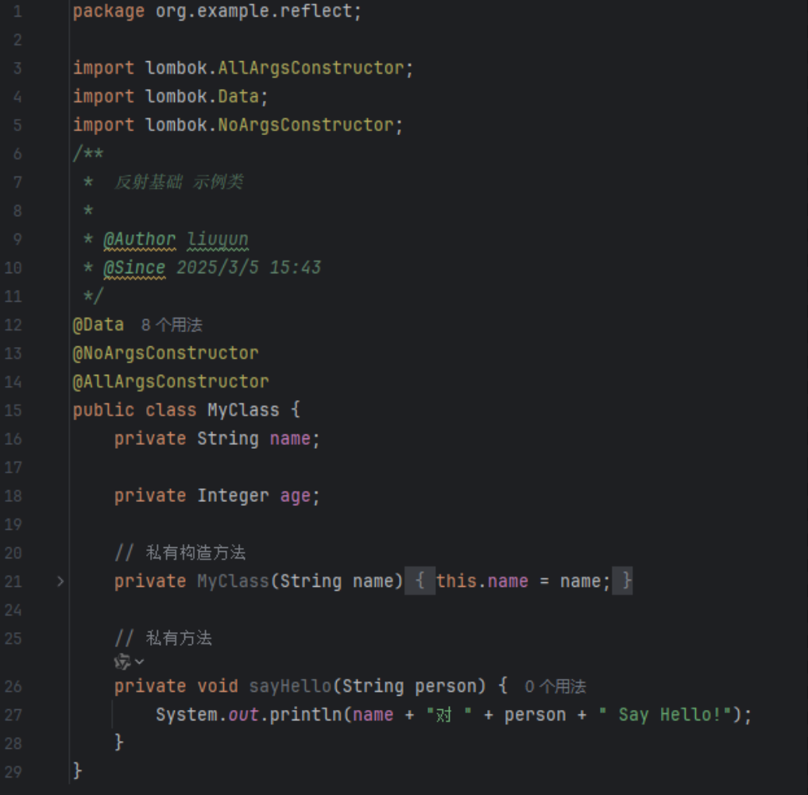
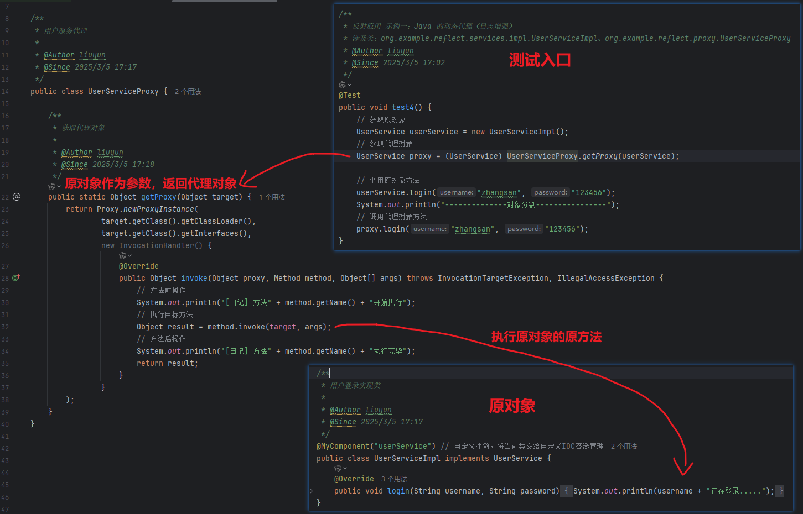
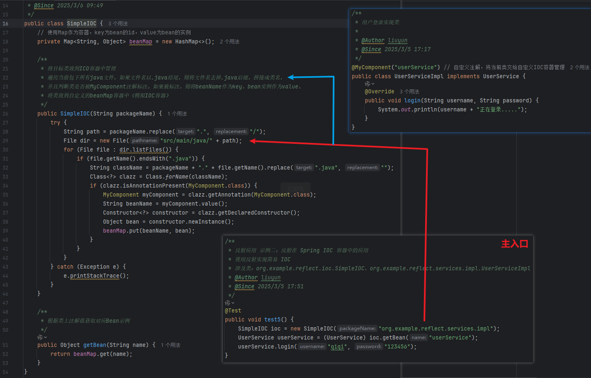
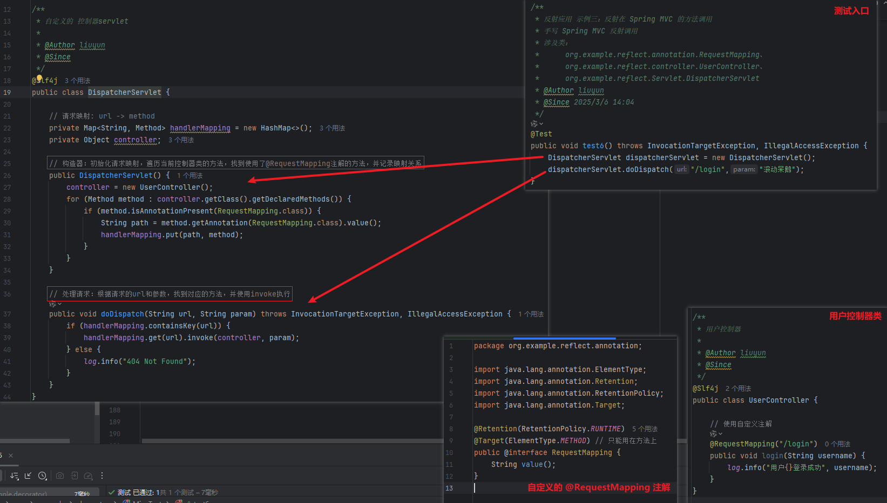

# 反射
文章中全部代码可以在我的 Github 上找到，地址：[Github-demo-ly](https://github.com/dashboard)。
当前**反射主题**路径：src/main/java/org/example/reflect
## 反射基础

### 基本概念：Java 反射（Reflection）允许在运行时动态获取类的信息、创建对象、调用方法、操作字段等。

核心类：
- Class<T>：表示 Java 类的元数据，也可以成为类对象。
- Constructor<T>：表示类的构造方法
- Method：表示类的方法
- Field：表示类的字段

### 基本操作流程：

获取类对象 -> 获取构造方法 -> 创建对象 -> [ 获取方法 -> 调用方法 ] 或  [ 获取字段 -> 操作字段 ]





#### 获取类对象
```java
Class<?> clazz1 = Class.forName("org.example.reflect.MyClass"); // 1.1、通过“全类名”获取类对象

MyClass obj = new MyClass(); // 1.2 通过“对象实例”获取类对象
Class<?> clazz2 = obj.getClass();

Class<?> clazz3 = MyClass.class; // 1.3 通过“类名.class"获取类对象
```

#### 获取构造方法
```java
Constructor<?> constructor1 = clazz1.getDeclaredConstructor(); // 获取无参构造

Constructor<?> constructor2 = clazz2.getDeclaredConstructor(String.class, Integer.class);// 获取有参构造
```

#### 创建对象
如果构造方法是私有的，则需要设置 accessible 为 true，再创建对象，否则会抛出异常。
> 报错：java.lang.IllegalAccessException: Class org.example.decorator.
> MianTest can not access a member of class org.example.reflect.MyClass with modifiers "private"

```java
Object instance1 = constructor1.newInstance(); // 并创建对象
System.out.println(instance1);
Object instance2 = constructor2.newInstance("张三",20); // 并创建对象
System.out.println(instance2);
```
控制台输出：
> MyClass(name=null, age=null) 
> 
> MyClass(name=张三, age=20)

#### 获取字段、操作字段
上面的`instance2`是 "张三"，20，现在把它改为 "赵六"。
```java
Field field = clazz1.getDeclaredField("name");
field.setAccessible(true);
field.set(instance1,"王五");
field.set(instance2,"赵六");
field.set(instance3,"钱七");
System.out.println(instance1+ "\n" + instance2+ "\n" + instance3);
System.out.println(field.get(instance1)+ " " + field.get(instance2)+ " " + field.get(instance3));
```
控制台输出：
> MyClass(name=王五, age=null)
> 
> MyClass(name=赵六, age=20)
> 
> MyClass(name=钱七, age=null)

#### 获取方法、调用方法
使用`invoke`方法调用方法。
```java
Method method = clazz2.getDeclaredMethod("sayHello", String.class);
method.setAccessible(true);
method.invoke(instance1,"小猫");
method.invoke(instance2,"小狗");
```
控制台输出：
> 王五对 小猫 Say Hello!
>
> 赵六对 小狗 Say Hello!

## 反射在 Java 和 Spring 中的应用

Java 反射在 JavaSE 和 Spring 中都有广泛应用，主要用于 动态代理、框架底层设计、AOP（面向切面编程）、Bean管理 等场景。

这里我们举三个例子:
### 反射应用 示例一：Java 的动态代理（日志增强）
在这里，我们通过反射，动态的创建一个代理对象，代理对象会调用目标对象的方法，并在方法执行前后，打印日志。
   

   控制台输出：
   ```bash
   zhangsan正在登录.....
   --------------对象分割----------------
   [日记] 方法login开始执行
   zhangsan正在登录.....
   [日记] 方法login执行完毕
   
   进程已结束，退出代码为 0
   ```
### 反射应用 示例二：反射在 Spring IOC 容器中的应用
我们使用 HashMap 模拟 IOC 容器，通过反射，动态的创建对象，并注入到容器中。使用时, 通过自定义的 IOC 容器取出对象进行调用。


   控制台输出：
   ```bash
   qiqi正在登录.....

   进程已结束，退出代码为 0
   ```
### 反射应用 示例三：反射在 Spring MVC 的方法调用
自定义一个 RequestMapping 注解，通过反射，扫描所有带有该注解的方法，放到 handlerMapping 容器中（模拟 Spring MVC 容器）, 当收到请求时，找到 Url 对应的方法再进行调用。

   
   控制台输出：
   ```bash
   11:15:18.234 [main] INFO org.example.reflect.controller.UserController - 用户滚动呆鹅登录成功
   
   进程已结束，退出代码为 0
   ```


## 总结
反射会调用 **比直接调用慢 10 倍左右**，JVM 也无法优化反射代码（如 JIT 编译）。
对于其安全性，反射可以绕过访问控制，修改私有字段，**在 Spring Boot 2.7+ 及 Java 17+，默认限制 setAccessible(true)，必须使用 --illegal-access=permit 选项才能修改私有字段。**

内容|	关键知识
-|-
反射核心| API	Class<?>、Field、Method、Constructor
创建对象|	clazz.getDeclaredConstructor().newInstance()
访问字段|	field.setAccessible(true); field.get/set()
调用方法|	method.invoke(instance, args)
应用场景|	动态代理、Spring IOC、AOP、ORM
性能优化|	缓存 Method、Field，避免频繁反射
安全性|	setAccessible(true) 在 Java 17+ 受限

反射应用| 	案例                          |	作用
-|------------------------------|-
动态代理| 	Proxy.newProxyInstance      |	实现 AOP（日志、权限、事务）
Spring IOC| 	Class.forName + newInstance | 	反射实例化 Bean 并存入容器            
Spring MVC| 	Method.invoke 调用 Controller |	解析 @RequestMapping，执行控制器方法